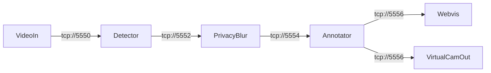

# OpenFilter Proof-of-Concept: Real-Time Annotated Pipeline

2026-09-18 · @Someone

## Overview

The goal is to prove out OpenFilter locally before day one, using a build that demonstrates the two things the role actually needs: reusable filter components, and the ability to slot the pipeline into a real external context rather than just a demo window.

Three deliverables, in order of how convincing they are:

1. **A working local pipeline** — webcam or video file in, object detection + annotation out, viewable in the browser via OpenFilter's built-in `Webvis` filter. This is the baseline: confirms the framework itself works end to end.
2. **A Streamlit control app** — the same running pipeline, but with live toggles (confidence threshold, class filter, privacy blur, metrics overlay) exposed through a UI instead of hardcoded config.
3. **A virtual-camera integration** — the annotated output registered as an OS-level webcam device, selectable in Zoom/Meet like any other camera. This is the standout piece: it proves the pipeline can sit in the path of something real, not just render to a browser tab.

All three reuse the *same* `Detector`/`PrivacyBlur`/`Annotator` filter classes — that reuse is itself the point, since it's exactly what OpenFilter's composable-filter design is supposed to buy you.

## Environment & prerequisites

**Confirmed:** building and demoing on a MacBook Pro (M5, Apple Silicon) — the OS-level virtual camera driver is OBS Virtual Camera (see below), and the M5's GPU lets `ultralytics` run YOLOv8n on PyTorch's `mps` backend instead of plain CPU, which should meaningfully beat the CPU frame-rate estimates used earlier in planning. Also grant camera access to Terminal (or whichever app launches the pipeline) under System Settings → Privacy & Security → Camera the first time `VideoIn` opens `webcam://0` — otherwise the process silently hangs waiting on a permission prompt that a non-interactive run never shows. Fallback if no webcam is handy during development: a looped sample `.mp4` — OpenFilter ships one at `examples/hello-world/example_video.mp4`.

**Python packages:**

```bash
pip install "openfilter[all]"
pip install ultralytics pyvirtualcam streamlit
```

`ultralytics` pulls in the YOLOv8n weights (`yolov8n.pt`, \~6MB) automatically on first run — no manual download or training needed. On the M5, request the Apple Silicon GPU backend explicitly rather than letting it default to CPU: `model = YOLO('yolov8n.pt'); model.to('mps')`, or pass `device='mps'` on each `.predict()` call. No extra install needed beyond a reasonably recent `torch`.

**OS-level virtual camera driver** (needed only for the video-call milestone, install ahead of time so it isn't a blocker mid-build):

- **OBS Virtual Camera (macOS)** — install OBS Studio (free); its bundled "OBS Virtual Camera" is what `pyvirtualcam` talks to, and OBS itself doesn't need to be running. The first time it's used, macOS prompts to approve the OBS camera extension under System Settings → Privacy & Security → Camera Extensions — approve it and restart whichever app is trying to grab the camera. Easy to miss, and it'll quietly block everything downstream if skipped.

## Directory structure

Lay it out so the reuse story is visible in the repo itself, not just in prose: `filters/` holds the four `Filter` subclasses, and both `pipelines/live.py` and `pipelines/batch.py` import from it — a reviewer can see at a glance that the same code drives the webcam demo, the video call, and the Streamlit batch tab.

```
openfilter-poc/
├── README.md              # what it is, a GIF of the video-call demo, quickstart
├── LICENSE
├── pyproject.toml         # deps, pinned versions
├── .gitignore
├── control.json.example   # committed template; control.json itself is gitignored
├── filters/
│   ├── __init__.py
│   ├── detector.py        # Detector
│   ├── privacy_blur.py    # PrivacyBlur
│   ├── annotator.py       # Annotator
│   ├── virtual_cam_out.py # VirtualCamOut
│   └── control.py         # shared ControlMixin
├── pipelines/
│   ├── live.py            # VideoIn → Detector → PrivacyBlur → Annotator → [Webvis, VirtualCamOut]
│   └── batch.py           # ImageIn → Detector → PrivacyBlur → Annotator → ImageOut (Tab 2)
├── app/
│   └── streamlit_app.py   # two-tab UI, launches pipelines/live.py as a subprocess
├── assets/
│   ├── sample_video.mp4   # fallback input for dev and the loop demo
│   └── demo.gif           # for the README
└── tests/
    └── test_filters.py    # light unit tests — control.json parsing, detection output shape
```

**`.gitignore`** — keep `control.json` out (it's runtime state, not config — commit `control.json.example` instead), plus `__pycache__/`, `.venv/`, `*.pt` (YOLO re-downloads weights on first run, no need to version a 6MB binary), and `.DS_Store` on the M5 Mac.

**README matters more than usual here** since the hiring team is the audience — lead with the demo GIF, a one-line "why this project" tying back to OpenFilter's own composable-filter design, then a quickstart that actually runs (`pip install -e .`, `python pipelines/live.py`). A repo that's easy to skim in two minutes says more than the code itself will.

`git init` and commit early — visible commit history (not one giant initial commit) is its own small signal of how you work.

### Git workflow

`main` stays protected — no direct commits, everything lands through a PR. Each Build order stage (below) is a natural feature-branch boundary: branch, build that milestone, open a PR, merge, move to the next — e.g. `feat/detector-filter`, `feat/control-channel`, `feat/streamlit-tab1`, `feat/privacy-blur-metrics`, `feat/virtual-cam`, `feat/streamlit-tab2`.

This also gives the hiring team a real commit/PR history to read instead of one final drop — showing how you work is worth as much here as the demo itself.

## Pipeline architecture

One synchronized chain, fanning out to two output filters at the end. `Detector` → `PrivacyBlur` → `Annotator` publish on a single `tcp://` port; `Webvis` and `VirtualCamOut` both subscribe to it independently — standard OpenFilter fan-out, no special wiring needed.



`VideoIn` source is `webcam://0` for the live/video-call milestones, or `file://<sample>.mp4!loop` for early development and the Streamlit batch tab. Each arrow is a real `sources`/`outputs` config pair — remember OpenFilter's two-port-per-endpoint rule (the port specified, plus port+1) when assigning these.

## Custom filters to build

Four filters, each a `Filter` subclass overriding `process()` (and `setup()`/`shutdown()` where needed).

| Filter | Responsibility | Reads from `frame.data` | Writes to `frame.data` |
| --- | --- | --- | --- |
| `Detector` | YOLOv8n (COCO, pretrained) inference on each frame | — | `detections`: list of `{class, box, score}` |
| `PrivacyBlur` | Pixelates boxes matching a configured class, if enabled | `detections`, live toggle state from `control.json` | mutates `frame.image` only |
| `Annotator` | Draws boxes/labels for non-blurred detections, overlays FPS | `detections` | mutates `frame.image`; also writes a `metrics.json` snapshot (detection counts) for Streamlit to read |
| `VirtualCamOut` | Sends the final frame to an OS-level virtual camera device | `frame.image` | none — side effect only, passes the frame through unchanged so `Webvis` still works downstream |

`VirtualCamOut` is the one filter with no OpenFilter built-in equivalent — it's a thin wrapper around `pyvirtualcam`:

```python
import pyvirtualcam
from openfilter.filter_runtime.filter import Filter

class VirtualCamOut(Filter):
    def setup(self, config):
        self.cam = None  # lazy-init once we know frame dimensions

    def process(self, frames):
        frame = frames['main'].ro_rgb
        img = frame.image
        if self.cam is None:
            h, w = img.shape[:2]
            self.cam = pyvirtualcam.Camera(width=w, height=h, fps=30)
        self.cam.send(img)
        self.cam.sleep_until_next_frame()
        return frame  # pass through so Webvis can still show it too

    def shutdown(self):
        if self.cam:
            self.cam.close()
```

## Control channel (live toggling)

OpenFilter configs are set at `setup()` time — there's no native way to change a running filter's parameters. Don't fight this with restarts; solve it with a flat JSON file that filters poll cheaply.

**`control.json`:**

```json
{
  "confidence_threshold": 0.5,
  "active_classes": ["person", "car", "laptop"],
  "blur_enabled": false,
  "blur_class": "person",
  "show_metrics": true
}
```

Each of `Detector`, `PrivacyBlur`, and `Annotator` reads this at the top of `process()`, caching by file mtime so it's not a disk read every frame:

```python
import json, os

class ControlMixin:
    _control_path = 'control.json'
    _control_mtime = 0
    _control = {}

    def get_control(self):
        try:
            mtime = os.path.getmtime(self._control_path)
            if mtime != self._control_mtime:
                with open(self._control_path) as f:
                    self._control = json.load(f)
                self._control_mtime = mtime
        except FileNotFoundError:
            pass
        return self._control
```

Streamlit just writes to `control.json` whenever a widget changes — no MQTT broker, no Redis, zero extra infra. This also correctly treats `process()` as the per-frame poll loop it is, rather than something to block inside waiting for an event (OpenFilter's own docs call out sitting in `process()` waiting on outside events as the thing people get wrong).

## Streamlit app

Two tabs. The live pipeline runs as its own subprocess launched from Streamlit (`subprocess.Popen`, PID tracked in `st.session_state`) — don't run heavy CV work inside Streamlit's own process, or the UI freezes on every rerun.

**Tab 1 — Live**

- Start/stop button controlling the pipeline subprocess
- Sidebar: confidence slider, class multiselect, privacy-blur toggle, metrics-overlay toggle — each write updates `control.json`
- Main pane: `st.components.v1.iframe("http://localhost:8000", height=500)` — embeds OpenFilter's own `Webvis` output directly, no need to rebuild video streaming
- Below it: `st_autorefresh` + `st.bar_chart` reading `metrics.json` for live detection counts

**Tab 2 — Upload & batch** (stretch goal, see Build order)

- `st.file_uploader` for a single image
- Runs the *same* `Detector`/`PrivacyBlur`/`Annotator` classes one-shot via `ImageIn → Detector → PrivacyBlur → Annotator → ImageOut`, triggered as a separate subprocess call, not the live pipeline
- Shows input/output side by side

Reusing the exact same filter classes across both tabs (and the video-call pipeline) is the core proof point for the whole exercise — it's what "composable filters" is supposed to buy you.

## Virtual camera / video call integration

Once `VirtualCamOut` is running, the OBS Virtual Camera driver installed in Environment & prerequisites registers a device. Zoom/Meet's camera dropdown will list "OBS Virtual Camera" right alongside the real webcam — select it like any other camera, no app-specific integration needed.

**Two things worth doing given what's riding on this:**

1. **Frame rate matters more than usual here.** YOLOv8n on the M5's mps backend should comfortably clear 30 fps — a real step up from generic CPU numbers — but confirm mps is actually engaged (check model.device, don't just assume) before trusting any figure, and measure it ahead of time rather than discovering lag live. If it's still choppy: run detection every 2nd–3rd frame and hold the last known boxes in between, rather than dropping to a heavier model.
2. **Dry-run the actual call app, not just the pipeline.** Start a Meet/Zoom test call to yourself first and confirm the virtual device shows real annotated video before relying on it for anything that matters. Camera driver quirks are the kind of thing that only show up at the OS/app boundary, not in `Webvis`.

Keep the Streamlit sidebar open on a second monitor during the call — being able to toggle the privacy blur live, mid-conversation, is the moment that actually lands.

## Build order

Each stage has a concrete pass/fail check — don't move on until it's confirmed, since each isolates a different risk before the next stage adds complexity on top.

- [ ] **Framework smoke test** — literal README quick-start (`VideoIn → Webvis`) against a sample video. Confirms OpenFilter itself works before any custom code is written.
- [ ] **`Detector` wired in** — `VideoIn → Detector → Annotator → Webvis`. Confirms boxes show up in the browser.
- [ ] **`control.json` wired up** — manually hand-edit the file while the pipeline runs, confirm behavior changes live. Isolates the control-channel risk before Streamlit is in the loop at all.
- [ ] **Streamlit Tab 1** — sidebar + iframe embed, confirm toggles reach the running pipeline through the UI.
- [ ] **`PrivacyBlur` + metrics chart** — add the blur filter and the `metrics.json`-driven bar chart.
- [ ] **`VirtualCamOut` + OS setup + dry-run call** — the standout milestone; do the Meet/Zoom test call to yourself before relying on it for anything real.
- [ ] **Streamlit Tab 2 (upload/batch)** — stretch goal; cut it if time-constrained, since it's a nice-to-have, not the core proof point.

## Open decisions and risks

- **Webcam availability on the demo/negotiation machine** — confirm before building the video-call milestone; fall back to a looped sample video for development regardless.
- **Which OS the demo runs on** — confirmed: macOS (MacBook Pro, M5). Environment & prerequisites and the Virtual camera section are now written for OBS Virtual Camera only.
- **Actual mps frame rate on the M5** — untested until measured; should meaningfully beat the earlier CPU estimates, but confirm PyTorch is actually using mps, not silently falling back to CPU, before trusting the number. Fallback if still choppy: detect every 2nd–3rd frame, hold last known boxes in between.
